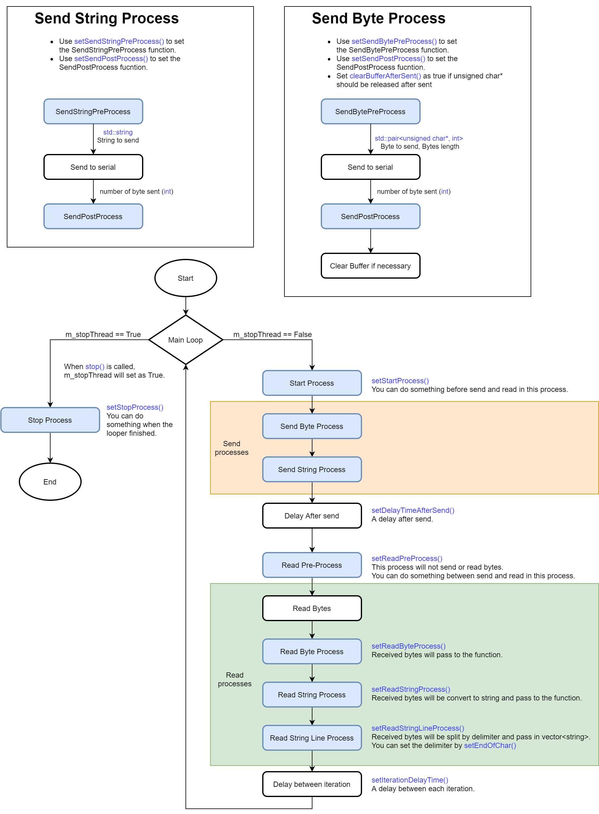

# SerialPortUtils

A window based serial port library in c++.

## Features
* Get COM port list in firendly names
* A looper to handle the serial port life cycle

# Usage

```cpp
#include <serial_port.h>

using namespace SerialPortUtils;

// Get all COM port
std::vector<SerialPortInfo> comPorts = SerialPort::getSerialPortList();
std::cout << comPorts[0].friendlyName << std::endl;

// Open Serial Port
SerialPort serialPort;
serialPort.setBaudRate(9600);
serialPort.open(comPorts[0].port);

// Send ASCII
serialPort.sendASCII("Do your job!!");

// Read ASCII
std::string receivedASCII = serialPort.readASCII(1024);

// Close Serial Port
serialPort.close();
```

# Looper

Looper is a loop thread worked in detach mode which makes serial port life cycle easy to handle.

## Usage

```cpp
#include <serial_port_looper.h>

using namespace SerialPortUtils;

// Create looper
SerialPortLooper serialPortLooper;
serialPortLooper.getSerialPort().setBaudRate(9600);
serialPortLooper.setEndOfChar('\n');

// Add processes
//    Add a start process which will try to connect serial port
serialPortLooper->setStartProcess([](std::unique_ptr<SerialPortUtils::SerialPort> &serialport) {
    if (!serialport->isOpened())
        serialport->open(1); // Try to open COM1
});

//    Add a read string linr process to count the number of line received.
serialPortLooper->setReadStringLineProcess([](std::vector<std::string> buffer) {
    std::cout << "Number of read lines: " + std::to_string(buffer.size()) << std::endl;
});

// Start
serialPortLooper.start();

// Stop
serialPortLooper.stop();
```

## Process types

```cpp
void SerialProcess(std::unique_ptr<SerialPort> &serialPort);
std::pair<unsigned char*, int> SendBytePreProcess();
std::string SendStringPreProcess();
void SendPostProcess(int n);
void ReadByteProcess(unsigned char* buffer, int bufferSize);
void ReadStringProcess(std::string buffer);
void ReadStringLineProcess(std::vector<std::string> buffer);
```

## Looper Flow chart


# Requirements

Minimum C++ 11

# Installation

## Cmake

1. Create **libs** folder in you project
2. Clone this repository in the **libs** folder
   ```
   git clone https://github.com/kcwongjoe/serial_port.git
   ```
3. Add the code in your project *CMakeLists.txt*
   ```
   # Serial port library
   add_subdirectory(./libs/serial_port)
   target_link_libraries(${PROJECT_NAME}
       PRIVATE
           serial_port
   )
   ```
## Dummy installation
1. Copy all files inside **src** folder and **include** folder to your project.

# license
Copyright (c) 2020 JOE Wong